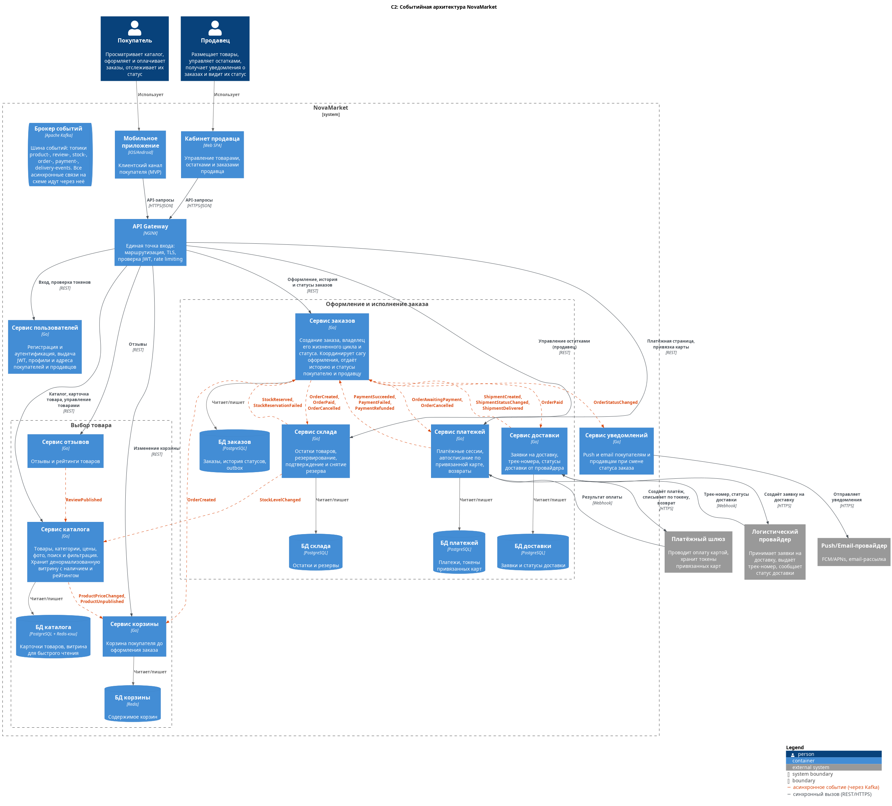

# Задание 1. Часть 1: событийная архитектура NovaMarket

Диаграмма C2: [diagrams/c2-main.puml](diagrams/c2-main.puml) (картинка: [diagrams/c2-main.png](diagrams/c2-main.png)).

## Микросервисы

| Сервис | Назначение | Хранилище |
|---|---|---|
| API Gateway (NGINX) | Единая точка входа для мобильного приложения и кабинета продавца: маршрутизация, TLS, проверка JWT, rate limiting | — |
| Сервис пользователей | Регистрация, аутентификация, JWT, профили и адреса покупателей и продавцов | PostgreSQL |
| Сервис каталога | Товары, категории, цены, фото, поиск и фильтры. Держит денормализованную витрину (наличие, рейтинг), которую обновляет по событиям, чтобы каталог отвечал быстро и без синхронных вызовов в другие сервисы | PostgreSQL + Redis |
| Сервис отзывов | Отзывы и рейтинги товаров | PostgreSQL |
| Сервис корзины | Корзина до оформления заказа | Redis |
| Сервис заказов | Создание заказа, владелец его статуса и истории. Координирует сагу оформления, отдаёт статусы покупателю и продавцу | PostgreSQL (+ outbox) |
| Сервис склада | Остатки, резервирование, подтверждение и снятие резерва | PostgreSQL |
| Сервис платежей | Платёжные сессии, привязка карт и автосписание, возвраты. Интеграция с платёжным шлюзом | PostgreSQL |
| Сервис доставки | Заявки в логистическую службу, трек-номера, статусы доставки (webhook) | PostgreSQL |
| Сервис уведомлений | Push и email покупателю и продавцу при смене статуса заказа | — |
| Брокер событий (Kafka) | Шина событий, через неё идут все асинхронные взаимодействия | — |

## Каталог событий

| Событие | Издатель | Подписчики | Зачем |
|---|---|---|---|
| `ProductPriceChanged`, `ProductUnpublished` | Каталог | Корзина | Актуализировать цену и доступность товаров в корзине |
| `StockLevelChanged` | Склад | Каталог | Обновить признак наличия в витрине каталога |
| `ReviewPublished` | Отзывы | Каталог | Пересчитать рейтинг товара в витрине |
| `OrderCreated` | Заказы | Склад, Корзина | Зарезервировать товары, очистить корзину |
| `StockReserved` / `StockReservationFailed` | Склад | Заказы | Перевести заказ в «Ожидает оплаты» или отменить его |
| `OrderAwaitingPayment` | Заказы | Платежи | Создать платёж (при привязанной карте списать автоматически) |
| `PaymentSucceeded` / `PaymentFailed` / `PaymentRefunded` | Платежи | Заказы | Перевести заказ в «Оплачен» или отменить его |
| `OrderPaid` | Заказы | Склад, Доставка | Подтвердить резерв, создать заявку на доставку |
| `OrderCancelled` | Заказы | Склад, Платежи | Снять резерв, вернуть деньги, если оплата уже прошла |
| `ShipmentCreated` / `ShipmentStatusChanged` / `ShipmentDelivered` | Доставка | Заказы | Трек-номер, дата получения, статусы «Передан в доставку» и «Доставлен» |
| `OrderStatusChanged` | Заказы | Уведомления | Уведомить покупателя и продавца (при статусе «Оплачен» продавец готовит товар к отправке) |

## Сага оформления заказа

1. Покупатель подтверждает заказ: `POST /orders` → Сервис заказов сохраняет заказ и публикует `OrderCreated`.
2. Склад резервирует товары → `StockReserved` (или `StockReservationFailed`, тогда заказ отменяется).
3. Заказ получает статус «Ожидает оплаты» → `OrderAwaitingPayment`. Сервис платежей создаёт платёж. Покупатель уходит на платёжную страницу, а с привязанной картой списание проходит автоматически.
4. Приходит `PaymentSucceeded` → заказ «Оплачен и готовится к отправке» → `OrderPaid`. Склад подтверждает резерв, Доставка создаёт заявку у провайдера, продавец получает уведомление.
   При `PaymentFailed` или по таймауту оплаты выходит `OrderCancelled`, и резерв снимается.
5. Доставка публикует `ShipmentCreated` (трек-номер) и дальше статусы, вплоть до `ShipmentDelivered` → «Доставлен».

Гарантия «оплатил — значит получит»: события публикуются через transactional outbox (at-least-once), подписчики обрабатывают их идемпотентно по `orderId`, а для каждого шага предусмотрены компенсирующие действия (снятие резерва, возврат).
