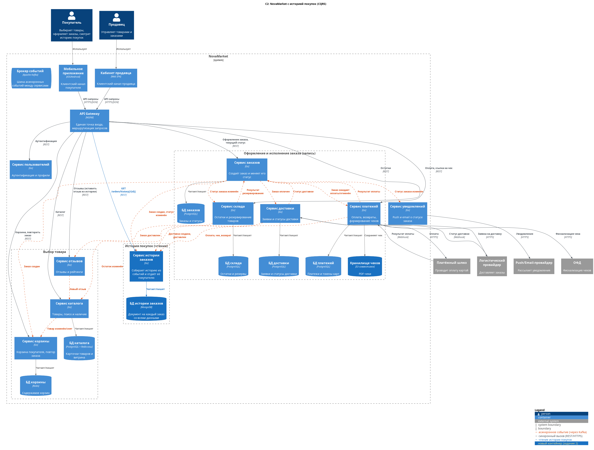

# Задание 2. История покупок

Решение: **CQRS**. Новый Сервис истории заказов собирает данные заказа из событий (заказы, платежи, доставка) и отдаёт историю одним запросом, не нагружая Сервис заказов.

- ADR: [ADR.md](ADR.md)
- C2: [diagrams/c2-main-v2.puml](diagrams/c2-main-v2.puml)

