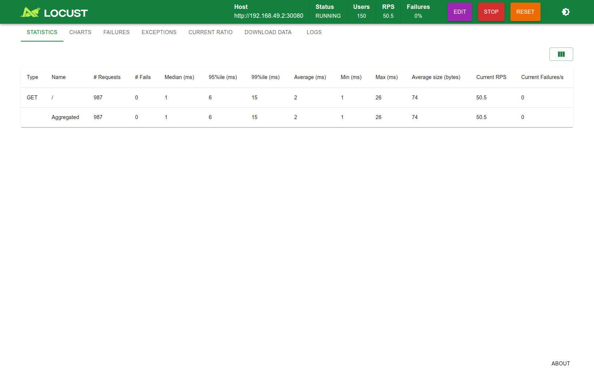
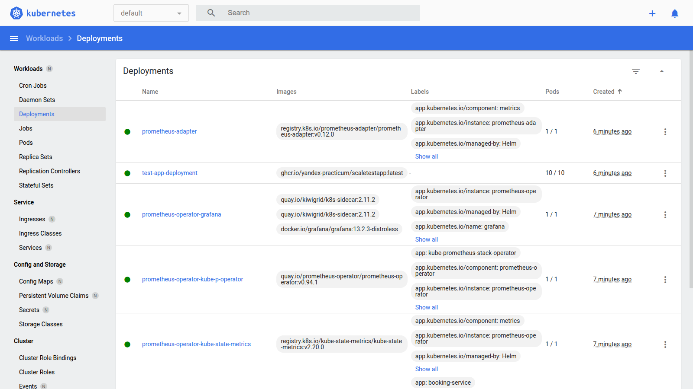
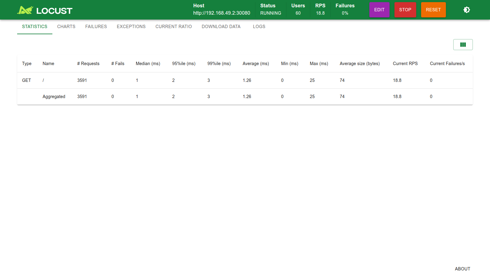
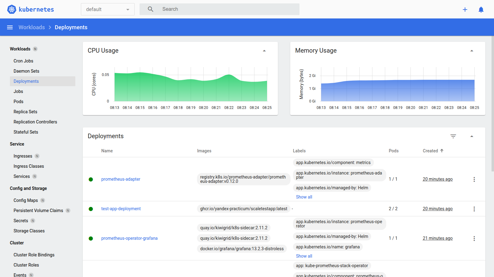

# Задание 3. Автомасштабирование по RPS (HPA + Prometheus Adapter)

Цель: научить под масштабироваться не только по CPU/памяти, но и по бизнес-метрике — количеству запросов в секунду (`http_requests_per_second`).

## Как это работает

1. Тестовое приложение [test-app/deployment.yml](test-app/deployment.yml) отдаёт `/metrics` со счётчиком `http_requests_total`.
2. [test-app/service-monitor.yml](test-app/service-monitor.yml) говорит Prometheus, что нужно скрейпить это приложение.
3. Prometheus Adapter ([helm/values.yml](helm/values.yml)) превращает сырой счётчик в метрику `http_requests_per_second` (скользящий rate за 2 минуты) и отдаёт её через Kubernetes Custom Metrics API.
4. [test-app/hpa.yml](test-app/hpa.yml) смотрит на эту метрику и на память, и масштабирует под, если RPS на один под превышает 10.

## Что пришлось поправить

В исходном `hpa.yml` метрика была описана как `type: External`. Но правило в `helm/values.yml` — это `rules.custom`, а такие правила регистрируются в Kubernetes только как `custom.metrics.k8s.io` (привязаны к конкретному поду), а не как `external.metrics.k8s.io`. Из-за этого HPA видел метрику как `<unknown>` и не масштабировался.

Исправление — поменять тип метрики на `Pods` (метрика на под, из custom metrics API):

```yaml
- type: Pods
  pods:
    metric:
      name: http_requests_per_second
    target:
      type: AverageValue
      averageValue: 10
```

## Как тестировали

1. Подняли **minikube**, поставили `kube-prometheus-stack` (Prometheus + Operator) и `prometheus-adapter` с правилом из `helm/values.yml`.
2. Применили манифесты из `test-app/`: deployment, service, service-monitor, hpa.
3. Запустили нагрузку **Locust** ([locust/locustfile.py](locust/locustfile.py)) — 300 пользователей бьют в `GET /`:
   ```
   locust -f locust/locustfile.py --host http://<minikube-ip>:30080 --headless -u 300 -r 20
   ```
4. Смотрели на `kubectl get hpa -w`.

Нагрузка в процессе (Locust, 150 пользователей, ~50 RPS, 0% ошибок):



## Результат

RPS на под превысил целевое значение (10), и HPA поднял количество подов с 1 до **10 (максимум по `maxReplicas`)**:

```
NAME                          TARGETS                      MINPODS   MAXPODS   REPLICAS
scalable-pod-identifier-hpa   memory: 64%/80%, 14282m/10   1         10        10
```

Скриншот дашборда minikube (`test-app-deployment`: 10/10 подов под нагрузкой):



После остановки нагрузки HPA аналогично уменьшает число подов обратно — вниз, до `minReplicas: 1`.

## Масштабирование по памяти — и чем оно отличается от RPS

HPA в [test-app/hpa.yml](test-app/hpa.yml) следит сразу за двумя метриками — памятью и RPS — и масштабирует под той, что требует больше реплик. Чтобы показать, что они срабатывают независимо друг от друга, память протестировали отдельно: временно убрали из HPA правило по RPS, оставив только `Resource: memory`.

Важный нюанс: под состоит из **двух контейнеров** — `test-app` (запрос 20Mi) и `istio-proxy` (нативный sidecar Istio, запрос 40Mi). HPA считает `%` использования памяти по **всему поду** — (память test-app + память istio-proxy) / (20Mi + 40Mi). Из-за этого собственное потребление sidecar'а (~30–40Mi, почти вся его квота) — это основная доля итогового процента, а не нагрузка от самого приложения.

Под лёгкой нагрузкой (локаст, низкий RPS) процент памяти органически дошёл до ~67–69% и дальше не рос — за разумное время 80% не набралось. Чтобы детерминированно показать срабатывание, временно снизили `memory.requests` у `test-app` с 20Mi до 5Mi (только для демонстрации, в закоммиченном манифесте осталось 20Mi) — это подняло процент выше порога, и HPA сразу отреагировал:

```
NAME                          TARGETS           MINPODS   MAXPODS   REPLICAS
scalable-pod-identifier-hpa   memory: 95%/80%   1         10        2
```

Locust в этот момент (RPS не участвует в решении — в HPA не было правила по RPS):



Дашборд minikube — `test-app-deployment` вырос с 1/1 до 2/2 именно из-за памяти:



**Разница между триггерами:**

| | Память | RPS |
|---|---|---|
| Источник метрики | metrics-server (CPU/Memory от kubelet) | Prometheus → Prometheus Adapter → Custom Metrics API |
| На что реагирует | суммарное потребление памяти **всех контейнеров пода** (включая Istio sidecar) | только запросы к приложению (`http_requests_total`) |
| В нашем тесте | уперлись не в нагрузку от приложения, а в базовое потребление sidecar'а | чисто нагрузочная метрика, растёт прямо пропорционально RPS |
| Результат | 1 → 2 пода | 1 → 10 подов (максимум) |

## Манифесты

- Deployment: [test-app/deployment.yml](test-app/deployment.yml)
- Service: [test-app/service.yml](test-app/service.yml)
- ServiceMonitor: [test-app/service-monitor.yml](test-app/service-monitor.yml)
- HPA: [test-app/hpa.yml](test-app/hpa.yml)
- Правила Prometheus Adapter: [helm/values.yml](helm/values.yml)
- Нагрузочный тест: [locust/locustfile.py](locust/locustfile.py)
