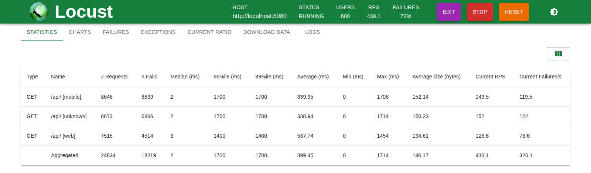
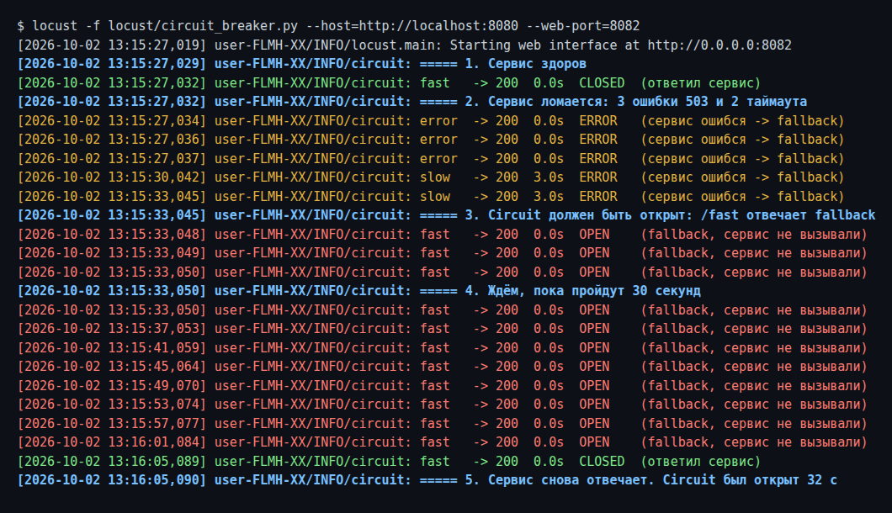
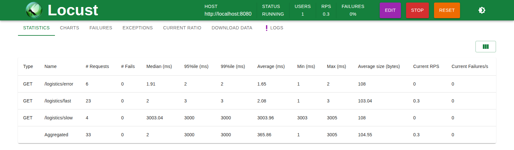

# Задание 4. Rate limiter и Circuit breaker в NGINX

Для каждого паттерна свой конфиг NGINX, и проверяются они по отдельности.

| Что | Конфиг | Тест |
|---|---|---|
| Rate limiter | [nginx/nginx.conf](nginx/nginx.conf) | [locust/rate_limiter.py](locust/rate_limiter.py) |
| Circuit breaker | [nginx/circuit-breaker.conf](nginx/circuit-breaker.conf) | [locust/circuit_breaker.py](locust/circuit_breaker.py) |

Запуск: [docker-compose.yml](docker-compose.yml). Оба конфига слушают порт `8080`, поэтому запускаются по одному, через профиль:

```bash
cd tasks/task_4
docker compose --profile rate-limiter up      # или
docker compose --profile circuit-breaker up
```

Тестовые сервисы (бэкенд, логистика, fallback) находятся в том же NGINX, на портах `8081`, `9090` и `9091` внутри контейнера.

---

## Часть 1. Rate limiter: отдельные лимиты для web и mobile

### Идея

Клиент говорит, кто он, через заголовок `X-Client-Type: web | mobile`. Всё остальное считается `unknown`.

| Группа | Лимит | Запас (`burst`) |
|---|---|---|
| web | 50 запросов/с | 70 |
| mobile | 30 запросов/с | 50 |
| unknown (нет заголовка или мусор) | 30 запросов/с | 50 |

Сверх лимита NGINX отвечает **429 Too Many Requests**. По умолчанию он отвечает 503, но этот код выглядит как «сервер упал».

### Как устроено

1. `map` переводит заголовок в `$client_type`: `web`, `mobile` или `unknown`.
2. Для каждой группы есть свой `map` и своя зона. Ключ зоны равен IP клиента, если запрос «свой», и пустой строке, если «чужой».
3. NGINX **не считает запросы с пустым ключом**. Поэтому три `limit_req` в одном `location` работают как три фильтра, и каждый запрос задевает только одну зону.

| Запрос | Зона web | Зона mobile | Зона unknown |
|---|---|---|---|
| `X-Client-Type: web` | считает | — | — |
| `X-Client-Type: mobile` | — | считает | — |
| без заголовка | — | — | считает |

Почему не по `User-Agent`: у мобилки он зависит от HTTP-библиотеки и может поменяться без предупреждения. Свой заголовок задаём мы сами. Подделать можно любой заголовок, поэтому для «чужих» оставлен отдельный строгий лимит.

### Тестирование

**Шаг 1. Ручная проверка через curl.** Отправили по 200 запросов одновременно для каждой группы:

```
web:    75 × 200, 125 × 429
mobile: 53 × 200, 147 × 429
none:   53 × 200, 147 × 429
```

Прошло примерно `burst` + несколько запросов: 70 для web и 50 для остальных. Остальные получили 429. Значит, лимиты считаются отдельно.

**Шаг 2. Locust.** В скрипте три вида пользователей: `WebUser`, `MobileUser` и `UnknownUser`. Каждый примерно раз в секунду шлёт `GET /api/products` со своим заголовком. Locust считает ответ 429 ошибкой, поэтому в колонке Fails видно, сколько запросов отрезал NGINX.

```bash
locust -f locust/rate_limiter.py --host=http://localhost:8080 --web-port=8082
```

Запуск: 600 пользователей, по 200 на группу. Каждая группа шлёт больше своего лимита.



**Как читать.** Успешные запросы = `Current RPS − Current Failures/s`:

| Группа | Current RPS | Failures/s (429) | Прошло | Лимит |
|---|---|---|---|---|
| web | 128.6 | 78.6 | **50** | 50 |
| mobile | 149.5 | 119.5 | **30** | 30 |
| unknown | 152 | 122 | **30** | 30 |

Каждая группа пропускает ровно свой лимит, и группы не мешают друг другу.

**Что ещё видно.** Время ответа до ~1.7 с. В `limit_req` нет флага `nodelay`, поэтому запросы в пределах `burst` не отклоняются, а **ждут в очереди**, пока не освободится место. Если нужно сразу отвечать 429 без ожидания, добавляют `nodelay`.

---

## Часть 2. Circuit breaker для логистики

### Требования и как они выполнены

| Требование | Как сделано |
|---|---|
| Таймаут ответа 3 с | `proxy_connect_timeout`, `proxy_send_timeout`, `proxy_read_timeout` = `3s` (было 30 с) |
| 5 ошибок подряд → 30 с не вызываем сервис | `max_fails=5 fail_timeout=30s` у сервера логистики |
| Пока сервис выключен — fallback | Второй сервер с пометкой `backup` отвечает заглушкой |
| После паузы вызовы восстанавливаются | Через 30 с NGINX снова пробует основной сервер |

Что считается ошибкой: обрыв, таймаут и ответы 5xx (`proxy_next_upstream error timeout http_500 http_502 http_503 http_504`). Такой запрос сразу получает fallback, а у сервиса растёт счётчик ошибок.

### Три состояния

```
 CLOSED ──5 ошибок──▶ OPEN ──30 с──▶ пробный запрос
   ▲                   ▲                 │
   │                   └─────ошибка──────┤
   └────────────────────успех────────────┘
```

| Состояние | Что происходит | Заголовок `X-Upstream` |
|---|---|---|
| CLOSED | Запрос идёт в сервис | `127.0.0.1:9090` |
| Ошибка | Сервис ошибся, ответил fallback | `127.0.0.1:9090, 127.0.0.1:9091` |
| OPEN | Сервис не вызывается, сразу fallback | `127.0.0.1:9091` |

Заголовок `X-Upstream` добавлен только для тестов: по нему видно, кто ответил.

### Что пришлось поправить в исходном манифесте

1. **Одного сервера в `upstream` мало.** Если сервер в группе один, NGINX игнорирует `max_fails` и никогда не считает его недоступным. Поэтому добавлен второй сервер `backup` с fallback-ответом.
2. **Fallback отвечает 200, а не 503.** Сначала fallback отвечал 503. Но 503 указан в `proxy_next_upstream`, поэтому NGINX считал ошибкой и сам fallback, ему больше некуда было идти, и клиент получал **502**. Это нашлось на первом прогоне.
3. **`127.0.0.1` вместо `localhost`.** Внутри контейнера `localhost` — это ещё и `::1` (IPv6). NGINX завёл бы два сервера, и запросы на IPv6 падали бы, потому что там никто не слушает.
4. **`/slow` на самом деле не тормозил.** В тестовом сервере из задания стоял обычный `return`, который отвечает сразу. Задержка 5 с сделана через njs-скрипт [nginx/njs/slow.js](nginx/njs/slow.js), иначе таймаут 3 с нечем проверить.
5. **`proxy_pass` со слешем в конце**, чтобы `/logistics/fast` уходил на сервис как `/fast`.

### Тестирование

**Шаг 1. Ручная проверка через curl.**

```
fast  -> 200  upstream=127.0.0.1:9090                   ← CLOSED
error -> 200  upstream=127.0.0.1:9090, 127.0.0.1:9091   ← ошибка 1
error -> 200  upstream=127.0.0.1:9090, 127.0.0.1:9091   ← ошибка 2
error -> 200  upstream=127.0.0.1:9090, 127.0.0.1:9091   ← ошибка 3
slow  -> 200  3.0s  upstream=127.0.0.1:9090, 127.0.0.1:9091  ← таймаут, ошибка 4
slow  -> 200  3.0s  upstream=127.0.0.1:9090, 127.0.0.1:9091  ← таймаут, ошибка 5
fast  -> 200  upstream=127.0.0.1:9091                   ← OPEN: сервис не вызывали
  ... ждём 31 с ...
fast  -> 200  upstream=127.0.0.1:9090                   ← снова CLOSED
```

Отдельно проверили неудачное восстановление. Через 30 с сервис всё ещё ломается: **одна** ошибка, и circuit сразу снова открыт ещё на 30 с, без новых пяти попыток.

```
  ... ждём 31 с ...
error -> 200  upstream=127.0.0.1:9090, 127.0.0.1:9091   ← пробный запрос упал
fast  -> 200  upstream=127.0.0.1:9091                   ← снова OPEN
```

**Шаг 2. Locust.** Скрипт запускает **одного** пользователя, чтобы шаги шли строго по порядку. По заголовку `X-Upstream` он пишет в лог состояние: CLOSED, ERROR или OPEN.

1. `/fast` — сервис здоров.
2. 3 × `/error` (503) и 2 × `/slow` (таймаут) — 5 ошибок.
3. 3 × `/fast` — должен ответить fallback.
4. `/fast` раз в 4 с, пока снова не ответит сервис.
5. Сколько секунд circuit был открыт.

```bash
locust -f locust/circuit_breaker.py --host=http://localhost:8080 --web-port=8082
```

Лог Locust:



Что видно:
- После 5-й ошибки (13:15:33) `/fast` сразу отвечает fallback, хотя сам сервис исправен. NGINX его просто не вызывает.
- Каждый `/slow` занимает ровно 3.0 с: срабатывает таймаут, клиент не ждёт 5 с.
- Через ~32 с (13:16:05) запрос снова попадает в сервис. Circuit закрыт.

Статистика Locust за прогон:



- `/logistics/slow`: максимум 3005 мс, при задержке сервиса 5 с. Таймаут работает.
- Fails = 0: клиент ни разу не получил ошибку, вместо неё отвечал fallback.

### Ограничения

- `max_fails` считает **5 ошибок за 30 с**, а не строго 5 подряд. Если между ошибками бывают успешные ответы, счётчик может сброситься не сразу. Для задания это близко к «5 подряд».
- Состояние хранится в каждом worker-процессе NGINX отдельно. Если workers несколько, каждый открывает circuit сам. Для точного общего счётчика нужен NGINX Plus (активные health checks) или отдельный сервис/библиотека.
